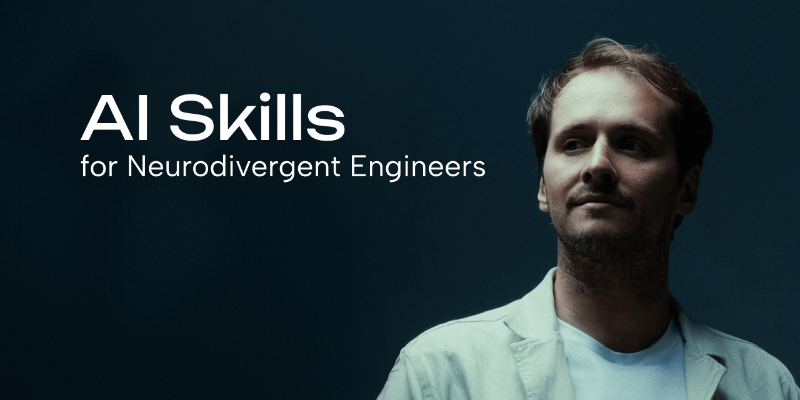

<p>
  <a href="https://skills.sh/guillaumelujan/skills">
    
  </a>
</p>

# Skills

[](https://skills.sh/guillaumelujan/skills)

Agent skills I use every day to stay the owner of my code — not a passenger in it.

AI lets you ship faster than you can absorb. Tests pass, features land, and yet each morning you understand a little less of your own project. These skills are the counterweight: small, composable rituals that keep the human in the loop as the codebase moves.

They're designed to be small, easy to adapt, and to work with any model. Hack around with them. Make them your own.

## Quickstart (30-second setup)

Install with the [skills.sh](https://skills.sh) installer:

```bash
npx skills@latest add guillaumelujan/skills
```

Pick the skills you want and the coding agents you want them installed on. Done.

### Manual install (Claude Code)

Copy any skill folder into your skills directory:

```bash
# Global (all projects)
cp -r skills/reclaim ~/.claude/skills/

# Or per-project
cp -r skills/reclaim your-project/.claude/skills/
```

## Skills

### [reclaim](./skills/reclaim/SKILL.md)

A short morning check-in that rebuilds trust and ownership of code that moved faster than you could absorb — especially AI-generated code, especially across several codebases.

Instead of re-reading diffs (which doesn't stick), it quizzes you with **active recall**: it asks *you* what happened, waits for your answer, then checks it against git and the actual code. Where you're solid, it confirms and moves on. Where you're fuzzy, it points you to the exact commit or line to re-own. A few minutes, then it stops — it's a confidence ritual, not an audit.

Especially valuable for developers with ADHD, who lose context faster than most and pay a heavy confidence tax for it.

**Invoke it** by saying things like:

- "reclaim" / "morning check-in"
- "catch me up on what I did"
- "I've lost the thread"
- "I don't trust this code anymore"

## Why these skills exist

The common failure mode of AI-assisted development isn't bad code — it's **orphaned code**. Code nobody can explain anymore, including the person who shipped it. Velocity without ownership curdles into dread: you stop trusting the code, then you stop trusting your own past decisions.

Every skill in this repo attacks that problem from a different angle. The first one, `reclaim`, hands you back the context you lost — so you can start the day as the owner again.

More skills coming. Watch the repo to follow along.

## License

[MIT](./LICENSE)
